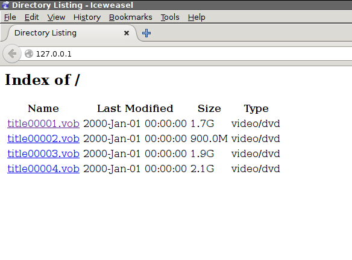
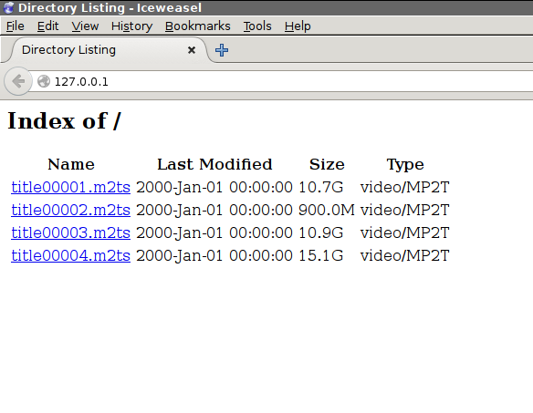
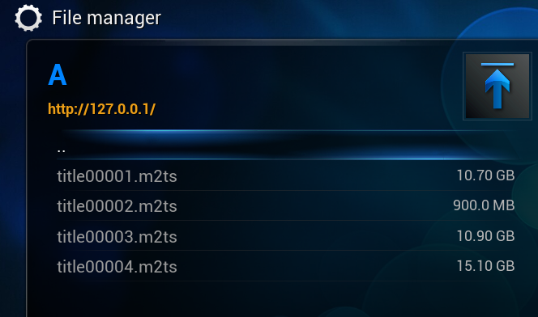
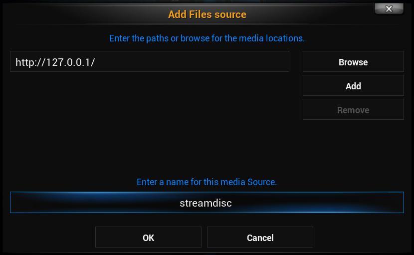

Tiny linux server application making non-encrypted DVD and BD content available over the network.

## Available as
- cgi module (streamdisc_cgi) integrating into an existing cgi capable web server, or as
- standalone http server (streamdisc_server).

## Building from source
- download source code via git
- run `./configure`
- build with `make`.
- dependencies are 
    - _libdvdread_ 
    - _libbluray_

## Usage
### General
- both _streamdisc_server_ (if run in background) and _streamdisc_cgi_ log to both _stderr_ and _/var/log/streamdisc.log_ (if that file is writable by the user).

### standalone server
- syntax: `streamdisc_server <port> <drive device file>` for running in foreground or if run by systemd
- syntax: `streamdisc_server <port> <drive device file> -b` for running in background (old-style daemon)
- example: `./streamdisc_server 80 /dev/sr0`
- make sure you have sufficient privileges to access the disc drive and port
- access disc
    - with your browser: point your browser to `your.server.ip.address:port/` (see screenshots below)
    - with KODI/XBMC: add a video or generic file source named _streamdisc_ with path `http://your.server.ip.address:port/` (see screenshots below)

### cgi module
- with _busybox httpd_: 
    - copy _streamdisc_cgi_ executable into `/your/webroot/cgi-bin/`

    - busybox httpd treats files in that folder as cgi executables.
    - some tweaking is necessary to make busybox httpd forward range requests to the cgi. A patched version of httpd.c (based on busybox 1.23.2) comes with streamdisc.
- with _lighttpd_:
    - copy _streamdisc_cgi_ executable into some subfolder of your web root, e.g. `/your/webroot/cgi-bin/`
    - configure lighttpd to treat files in that folder as cgi executables.
- access disc
    - with your browser: point your browser to `your.local.ip.address:port/cgi-bin/streamdisc_cgi/`
    - with KODI/XBMC: add a video or generic file source named _streamdisc_ with path `http://your.local.ip.address:port/cgi-bin/streamdisc_cgi/`

## License
streamdisc is free software; you can redistribute it and/or modify
it under the terms of the GNU General Public License as published by
the Free Software Foundation; either version 2 of the License, or
(at your option) any later version.

streamdisc is distributed in the hope that it will be useful,
but WITHOUT ANY WARRANTY; without even the implied warranty of
MERCHANTABILITY or FITNESS FOR A PARTICULAR PURPOSE.  See the
GNU General Public License for more details.

## Credits
A significant part of the code for the standalone streamdisc_server was taken from [nweb](http://www.ibm.com/developerworks/systems/library/es-nweb/).

## Screenshots
### DVD content in web browser

### BluRay content in web browser

### Integration in KODI/XBMC media center

